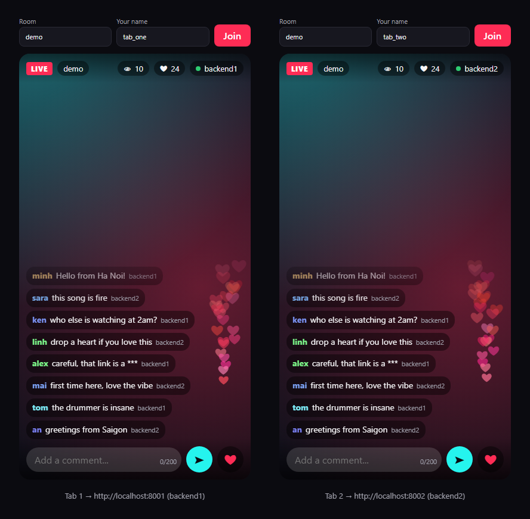
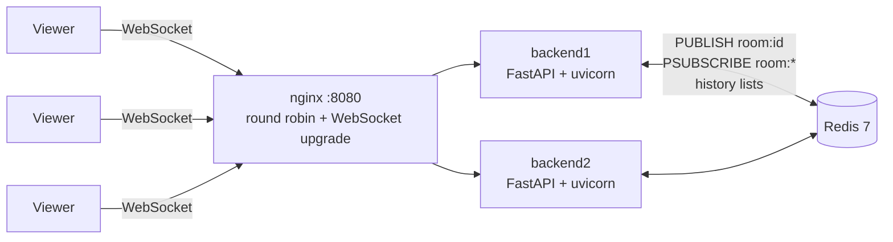
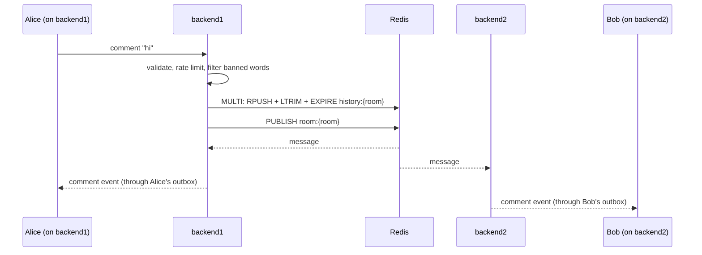

# Live Comments

[](https://github.com/emilia2008/live-comments/actions/workflows/ci.yml)

A realtime backend for the comments and likes of live-stream rooms, in the style of TikTok LIVE.
Viewers connect over WebSocket. Several backend instances run behind nginx and stay in sync through
Redis Pub/Sub. A multi-process load test measures end-to-end latency (p50/p95/p99) and throughput,
and every performance fix below comes with before/after numbers measured on one laptop.

**Live demo:** https://live-comments-dj5v.onrender.com/?room=lobby — open it in two tabs (or on your
phone) and comment. It runs on Render's free plan: after 15 minutes without visitors the service
sleeps, and the next visit waits about a minute while it wakes up.



## Features

| Feature | How |
|---|---|
| Live rooms | WebSocket `/ws/rooms/{room_id}?user={user_id}` |
| Realtime comments | Up to 200 characters, delivered to everyone in the room, on every instance |
| Batched likes | Likes are counted per room and sent as one `likes` event every 200 ms, not one event per tap |
| Viewer count | Total across all instances, sent when it changes, at most once per second |
| Anti-spam | Token bucket per user: burst of 5 comments, then 1 per second; extra comments get an `error` event |
| Banned words | Whole words replaced with `***`, case-insensitive (`class` is safe when `ass` is banned) |
| Recent history | New viewers get the last 50 comments of the room (Redis list, `RPUSH` + `LTRIM`) |
| Several servers | 2+ instances behind nginx, synchronized with Redis Pub/Sub |
| Slow viewers | Each viewer has a bounded outbox, so one stalled phone cannot freeze the room |
| Monitoring | `GET /health`, `GET /stats`, Prometheus `GET /metrics` |
| Demo page | One HTML file with plain JavaScript: dark live-stream UI, rising comments, floating hearts, auto-reconnect |
| Load test | Thousands of viewers over several processes; p50/p95/p99, throughput, delivery ratio |

## Architecture



No backend sends a comment straight to its viewers. It publishes the event to the Redis channel
`room:{room_id}`; every instance (including itself) receives it and forwards it to **its own** viewers
of that room. So a viewer on backend2 sees a comment that was sent to backend1.



Inside one instance (`app/service.py`, `app/rooms.py`):

- one task per viewer reads its frames (`handle_viewer`);
- one sender task per viewer drains that viewer's **outbox** (a bounded queue). `broadcast()` only puts
  the already-serialized JSON string into each outbox, so it never waits for a slow socket;
- three background tasks: the Redis listener, the like flusher (every 200 ms) and the viewer counter
  (every second, it publishes this instance's counts on the `viewers` channel; reports older than
  5 seconds are ignored, so a crashed instance stops being counted).

## Message protocol

Connect to `ws://host/ws/rooms/{room_id}?user={user_id}`. Both ids must match `^[A-Za-z0-9_-]{1,32}$`;
otherwise the server closes the connection with code `1008`.

Client → server:

```json
{"type": "comment", "text": "hello"}
{"type": "like"}
```

Server → client (every event has `type` and `sent_at`, a Unix timestamp in milliseconds):

| type | When | Example |
|---|---|---|
| `history` | Once, right after joining | `{"type":"history","room_id":"lobby","instance":"backend1","comments":[...],"sent_at":1791280059469}` |
| `comment` | Someone in the room commented | `{"type":"comment","id":"e8bf...","room_id":"lobby","user":"alice","text":"hello ***","instance":"backend2","sent_at":1791280059478}` |
| `likes` | Every 200 ms per instance, if the room got likes | `{"type":"likes","room_id":"lobby","count":17,"sent_at":1791280059554}` |
| `viewers` | On join, then when the count changes (at most 1/s) | `{"type":"viewers","room_id":"lobby","count":1234,"sent_at":1791280060053}` |
| `error` | Only to the sender | `{"type":"error","code":"rate_limited","message":"Too many comments. You can send 1 per second.","sent_at":...}` |

Error codes: `invalid_message` (bad JSON, unknown type, empty or longer than 200 characters),
`rate_limited`, `server_error` (Redis unavailable).

**Batching:** a WebSocket frame holds one event (a JSON object) or, when several events were already
waiting for that viewer, a JSON array of events. Clients handle both with one line:
`const events = Array.isArray(data) ? data : [data];`. A quiet room always gets single objects.

HTTP endpoints: `GET /` (demo page), `GET /health`, `GET /stats` (this instance only), `GET /metrics`.

Captured during a 2,000-viewer load test (viewers split over two instances):

```console
$ curl localhost:8001/stats
{"instance":"backend1","connections":1000,"rooms":5,"messages_sent":68691,"frames_sent":68685,
 "messages_dropped":0,"comments_received":308,"likes_received":0,"rate_limited":0}
```

## Running it

### Locally, one instance, no Redis

With `REDIS_URL` unset the app keeps everything in memory, which is enough for one instance.

```bash
python -m venv .venv
source .venv/bin/activate          # Windows: .venv\Scripts\activate
pip install -r requirements-dev.txt
uvicorn app.main:app --reload      # open http://localhost:8000 in two tabs
pytest                             # unit + WebSocket tests, no Redis or network needed
```

### Locally, two instances with Redis

```bash
redis-server &
REDIS_URL=redis://localhost:6379/0 INSTANCE_ID=backend1 uvicorn app.main:app --port 8001 --ws-per-message-deflate false &
REDIS_URL=redis://localhost:6379/0 INSTANCE_ID=backend2 uvicorn app.main:app --port 8002 --ws-per-message-deflate false &
python loadtest/cross_instance_check.py ws://localhost:8001 ws://localhost:8002
```

The check connects Alice to the first instance and Bob to the second and verifies that comments,
likes and the viewer count cross over.

### Docker Compose: Redis + 2 backends + nginx

```bash
docker compose up --build
```

- http://localhost:8080 — through nginx (round robin, WebSocket upgrade)
- http://localhost:8001 and http://localhost:8002 — backend1 / backend2 directly. Open one tab on each,
  join the same room, and comments typed in one tab appear in the other, tagged with the backend that
  accepted them.

The CI workflow builds this stack on every push and runs the cross-instance check against
the two backends directly and through nginx.

### Deploy for free on Render

The live demo above runs on [Render](https://render.com)'s free plan, straight from this repository's
`Dockerfile`. Two ways to get the same:

- **Blueprint (everything as code):** Render dashboard → *New* → *Blueprint* → pick this repository.
  [`render.yaml`](render.yaml) creates the web service plus a free Key Value (Redis) instance that is
  reachable only from inside Render, and sets `REDIS_URL` and `INSTANCE_ID`.
- **By hand:** *New* → *Web Service* → connect the GitHub repository → language *Docker* → instance
  type *Free* → *Deploy*. Without `REDIS_URL` the app runs in memory mode, which is correct for one
  instance. Optionally add the environment variable `INSTANCE_ID=render-free`; otherwise the
  instance is named after Render's long container hostname.

The container listens on `$PORT` when the platform sets it (Render uses 10000) and on 8000 otherwise.
Free plan limits (from [render.com/docs/free](https://render.com/docs/free)): a single instance, so
the multi-instance setup is shown with Docker Compose and CI rather than on Render; the service sleeps
after 15 idle minutes and takes about a minute to wake; 750 free instance hours per month; a free Key
Value instance keeps no data on disk, so a restart clears the comment history.

Check a deployment end to end (both viewers land on the single instance, hence the flag):

```bash
python loadtest/cross_instance_check.py wss://live-comments-dj5v.onrender.com wss://live-comments-dj5v.onrender.com --allow-same-instance
```

Please do not point the load test at the free demo; it shares a small machine with other users.

### Load test

```bash
python loadtest/run.py --url ws://localhost:8001 --url ws://localhost:8002 \
    --viewers 500,2000,5000 --rooms 10 --senders 100 --duration 30 --processes 6
```

| Option | Meaning |
|---|---|
| `--url` | Backend URL; repeat it to spread viewers over several backends (viewer *i* uses URL *i* mod *n*) |
| `--viewers` | WebSocket connections; a comma-separated list runs several levels |
| `--rooms` | Viewers are spread evenly over this many rooms |
| `--senders` | How many of the viewers also comment, each once per second (the rate limit allows that) |
| `--duration` | Seconds of sending per level |
| `--processes` | Load generator processes (one Python process uses one CPU core) |
| `--stuck-viewers` | Extra viewers that never read, to test slow consumers |

Latency is measured from the moment the sender sends a comment to the moment a viewer receives it.
The sender writes `time.perf_counter()` into the comment text; that clock is precise to 0.1 µs and
shared by all processes on one machine. (`time.time()` on Windows with Python 3.12 has a nominal
resolution of 15.6 ms, too coarse for millisecond latencies.)

### Configuration

| Variable | Default | Meaning |
|---|---|---|
| `REDIS_URL` | empty | Empty = single instance, in memory. Otherwise e.g. `redis://redis:6379/0` |
| `INSTANCE_ID` | `hostname-pid` | Name of this instance, shown to viewers and used in viewer-count reports |
| `BANNED_WORDS` | `idiot,stupid,scam` | Comma-separated list |

## Load test results

All numbers below were measured by `loadtest/run.py` on one laptop. Nothing is estimated.

**Machine.** Intel Core i7-1255U (10 cores: 2 performance + 8 efficiency, 12 threads), 15.7 GB RAM,
Windows 11 Home (10.0.26200), running on battery with the "Balanced" power plan. Python 3.12.1,
uvicorn 0.54 (asyncio Proactor event loop; uvloop does not exist on Windows), Redis 5.0.14.1 native
Windows port. The backends, Redis and the 6 load generator processes all share this one CPU.

**Setup notes.**
- Docker is not installed on this laptop, so the runs use native processes with the same code and the
  same uvicorn flags as the `Dockerfile`, instead of `docker compose`. The Compose stack itself is
  built and checked by CI on every push.
- Viewers connect straight to the backends, and the load generator spreads them round robin, like the
  balancer would. nginx for Windows documents a limit of 1,024 connections per worker, too few for these
  tests; the nginx config was checked with smaller numbers.
- Redis 5 native port instead of Redis 7: the Redis 7 build for Windows (msys2) added 35–56 ms to *every*
  command (`redis-cli --latency`), the native port about 1 ms. Docker and CI use `redis:7-alpine`.

**Workload.** 10 rooms, viewers spread evenly. 100 viewers also comment, once per second each
(100 comments/s). Every comment must reach everyone in its room, so the system must deliver
`10 × viewers` comments per second: 5,000/s at 500 viewers, 50,000/s at 5,000 viewers. 30 seconds of
sending per level. *Latency* = time a viewer received a comment − time the sender sent it.
*Delivered* = comments received / comments that should have been received (rooms × viewers), counted
3 seconds after sending stops; below 100% means the servers were still behind.

### Before and after the fixes (2 instances)

"Before" is the first working version (commit `b325b9c`, plus the Redis pool fix) with uvicorn's default
settings. "After" is the current code.

| Version | Viewers | Deliveries/s | p50 ms | p95 ms | p99 ms | Delivered |
|---|---:|---:|---:|---:|---:|---:|
| before | 500 | 5,000 | 27.7 | 63.4 | 80.9 | 100.00% |
| after | 500 | 5,000 | 27.9 | 74.1 | 116.0 | 100.00% |
| before | 2,000 | 18,038 | 4,193 | 6,895 | 7,428 | 90.19% |
| after | 2,000 | 20,000 | 1,158 | 1,536 | 1,657 | 100.00% |
| before | 5,000 | 18,136 | 13,577 | 23,121 | 23,574 | 54.30% |
| after | 5,000 | 29,423 | 8,903 | 16,431 | 17,431 | 69.01% |

At light load the new per-viewer sender tasks cost a little (p99 81 → 116 ms at 500 viewers). Under
load the maximum throughput of two instances went from about 18,000 to about 29,000 deliveries per
second, and at 2,000 viewers p99 dropped from 7.4 s to 1.7 s with nothing lost. 5,000 viewers at this
rate is more than two instances can handle on this laptop (next table).

### 1 vs 2 vs 4 instances (current code)

| Instances | Viewers | Deliveries/s | p50 ms | p95 ms | p99 ms | Delivered | Errors |
|---:|---:|---:|---:|---:|---:|---:|---:|
| 1 | 500 | 5,000 | 390 | 630 | 763 | 100.00% | 0 |
| 1 | 2,000 | 8,851 | 10,479 | 20,457 | 22,055 | 52.48% | 489 |
| 1 | 5,000 | 9,924 | 11,926 | 25,734 | 29,944 | 23.67% | 564 |
| 2 | 500 | 5,000 | 27.9 | 74.1 | 116.0 | 100.00% | 0 |
| 2 | 2,000 | 20,000 | 1,158 | 1,536 | 1,657 | 100.00% | 0 |
| 2 | 5,000 | 29,423 | 8,903 | 16,431 | 17,431 | 69.01% | 442 |
| 4 | 2,000 | 20,000 | 141 | 308 | 421 | 100.00% | 0 |
| 4 | 5,000 | 49,683 | 2,717 | 4,868 | 5,447 | 100.00% | 19 |

0 connection errors in every run. "Errors" are comments rejected by the rate limiter (an overloaded
server reads several queued comments of one sender at once, which looks like a burst) and, for one
instance, 20 and 80 `server_error`s (waiting more than 5 s for a pooled Redis connection).

How to read it: one instance tops out at about **10,000 deliveries per second** (one CPU core is
100% busy). Adding instances raises the ceiling: about 29,000/s with two and at least 49,700/s with
four, where all 5,000 viewers got every comment. With 2,000 viewers, p99 goes from 22 s (1 instance)
to 1.7 s (2) to 0.42 s (4). This is exactly why the design shares events through Redis instead of
keeping everything in one process.

### Up to 10,000 connections at a moderate comment rate

Same setup, but 20 commenters (2 comments per second per room), so each viewer receives 2 comments
per second and the system must deliver `2 × viewers` per second.

| Instances | Viewers | Deliveries/s | p50 ms | p95 ms | p99 ms | Delivered | Errors |
|---:|---:|---:|---:|---:|---:|---:|---:|
| 1 | 1,000 | 2,000 | 8.6 | 19.7 | 27.9 | 100.00% | 0 |
| 1 | 5,000 | 10,000 | 41.0 | 343.3 | 417.2 | 100.00% | 0 |
| 1 | 10,000 | 15,099 | 5,624 | 10,973 | 11,557 | 77.97% | 19 |
| 2 | 1,000 | 2,000 | 8.9 | 21.3 | 27.4 | 100.00% | 0 |
| 2 | 5,000 | 10,000 | 28.5 | 116.3 | 241.6 | 100.00% | 0 |
| 2 | **10,000** | **20,000** | **43.8** | **280.8** | **360.9** | **100.00%** | **0** |

All 10,000 WebSocket connections opened without a single error in both cases. One instance cannot
push 20,000 messages per second; two instances deliver every comment with p99 of 361 ms.

### One stuck viewer (slow consumer)

2 instances, 1 room, 200 normal viewers, 50 commenters, plus 2 extra viewers that never read and have
a 4 KB receive buffer (`--stuck-viewers 2`), like phones that lost signal. Only the 200 normal
viewers are measured. Both versions run with the same uvicorn flags; only the sending code differs.

| Version | Deliveries/s | p50 ms | p95 ms | p99 ms | Delivered |
|---|---:|---:|---:|---:|---:|
| before: one `await send()` after another | 5,068 | 10.9 | 27,156 | 28,361 | 50.68% |
| after: one outbox + sender task per viewer | 10,000 | 8.2 | 16.7 | 21.3 | 100.00% |

Before, two stuck phones froze the room for the rest of the test. After, nobody else notices; each
instance dropped about 970 messages meant for its stuck viewer and counted them in `messages_dropped`.
(With uvicorn's default compression on, the old version survived the same 40-second test
(p99 34 ms): compressed messages fill the stuck buffers more slowly, which hides the bug for longer
but does not fix it.)

### Bottlenecks found and fixed

Each fix came from a measurement, not a guess.

1. **50–120 ms latency even with 2 viewers.** WebSocket ping was under 1 ms, so the network was fine.
   `redis-cli --latency` showed 56 ms per command on the Redis 7 Windows build. Switching to the
   native port: ~1 ms per command, 4–7 ms for a full comment round trip.
2. **Redis connections exploding.** After a 200-viewer test Redis had 201 clients: the default pool
   opens a new connection for every concurrent command (every join reads the history). A
   `BlockingConnectionPool` of 50 per instance keeps it bounded.
3. **No recovery after a Redis restart.** `Redis.from_url()` builds connections with zero retries, so
   the first command on a dead pooled connection failed. Added a retry with backoff; verified by
   killing and restarting Redis during a cross-instance check.
4. **Backend CPU at 98–100% while the load generators were at ~50%.** `py-spy` showed ~20% of the
   backend's time in `permessage-deflate`: every ~200-byte message was compressed separately for every
   viewer. Turned off (`--ws-per-message-deflate false`).
5. **Sequential sends.** `for ws in room: await ws.send_text(...)` waits whenever one socket's buffer is
   full. Proven with `--stuck-viewers` (table above) and fixed with one outbox and sender task per viewer.
6. **One system call per message.** After that, the profile was dominated by socket writes (~28–35%) and
   event-loop overhead (~27%); our own code was ~3%. Events that are already waiting for a viewer are now
   sent together as one JSON-array frame: in the "after, 2 instances" run, backend1 sent 886,581 events
   in 356,618 frames (2.5 events per frame).
7. **`ConnectionRefusedError` while opening thousands of connections.** Windows desktop editions cap the
   pending-connection queue far below uvicorn's backlog of 2048. The load generator now limits
   concurrent handshakes and retries with backoff, like real clients do.

What is left is the cost of Python's event loop and the Windows socket API for each frame on one core,
which is why the next step is more instances (or more efficient batching, see Design notes).

## Design notes

**Why Redis Pub/Sub.** Instances must share events, not state: a comment only needs to reach whoever is
watching right now. Pub/Sub does exactly that with one `PUBLISH` per event and adds about 1 ms.
It is fire-and-forget (at-most-once): an instance that is disconnected from Redis for a moment misses
those events. For live comments that is acceptable, and the 50-comment history covers reconnects.
Events that must never be lost (gifts, payments) belong in Redis Streams or Kafka.
Each instance uses one `PSUBSCRIBE room:*`, which is the simplest correct choice; with tens of
thousands of rooms, subscribing per room (or sharded `SSUBSCRIBE`) would stop every instance from
receiving every room's traffic.

**Why batch likes.** Likes are frequent and individually meaningless. Sending each tap to every
viewer costs `likes/s × viewers` messages. Counting them per room and flushing every 200 ms costs at
most `5 × instances` events per room per second, no matter how many people tap. With 500 viewers and
100 taps per second, that is 2,500 messages per second instead of 50,000.

**Token bucket.** Each user has a bucket of 5 tokens refilled at 1 token per second. A comment takes a
token; an empty bucket means `rate_limited`. It allows a short burst but caps the long-run rate, needs
O(1) memory per user and no timers (tokens are recomputed from the elapsed time on each call). Full
buckets are identical to new ones, so they are dropped every second to keep memory small.
The clock is injected, so tests move time without sleeping.

**Viewer count across instances.** `INCR`/`DECR` in Redis would be simpler but stays wrong forever if
an instance crashes with viewers connected. Instead each instance publishes its own counts once per
second and every instance sums the fresh reports; a silent instance is ignored after 5 seconds.

**One outbox per viewer.** The first version sent to each viewer in turn with `await send()`. uvicorn
makes `send()` wait while a socket's buffer is full, so one viewer who stopped reading froze the
whole room, and because broadcasting ran inside the Redis listener, every room on that instance.
Now `broadcast()` only enqueues; each viewer has its own sender task and a 256-message outbox. A viewer
that falls further behind loses new messages (counted in `messages_dropped`) instead of slowing others.

**Joining without gaps.** A new viewer is registered first and reads the history second, so a comment
published in between can arrive twice but is never lost; clients drop duplicates by `id`. History is
written before the sender task starts, so it always arrives before the live events already queued.

**Limitations.**
No authentication (`?user=` is trusted); the rate limit is per instance, so a user connected to two
instances gets twice the limit; Redis is a single point of failure; Pub/Sub can drop events during a
Redis disconnect; every instance receives every room; slow viewers silently miss messages; the banned
word filter is easy to evade; history keeps only 50 comments for one day; reconnects in the demo page
use exponential backoff without random jitter.

**Scaling further.**

- *More instances.* Each uvicorn process uses one CPU core; the tests below show capacity growing with
  the number of instances. In production: one instance per core, many machines.
- *Room sharding.* Route each room to a group of servers (consistent hashing on `room_id` at the load
  balancer) and subscribe per room instead of `room:*`, so a server only receives rooms it serves.
  Redis Cluster with sharded Pub/Sub (`SPUBLISH`) spreads the broker load too.
- *Kafka.* When events must be durable or consumed by other systems (moderation, analytics, storage),
  publish to a partitioned log (partition by `room_id`) and let edge servers consume from it.
- *Batching on the wire.* Already done adaptively per viewer; a fixed 100–200 ms batch per room would
  cut per-message cost further at the price of a small, constant delay.
- *Rooms with millions of viewers.* 10 comments/s to 1,000,000 viewers is 10,000,000 messages/s. Use a
  fan-out tree (broker → hundreds of edge servers → viewers), show each viewer a sample of comments
  (friends and top comments first, a few per second), keep likes and gifts as aggregated counters, and
  write the edge fan-out in a language without a GIL (Go, Rust, C++).

## Project layout

```
app/
  main.py          FastAPI app: WebSocket route, /health, /stats, /metrics, demo page
  config.py        settings from environment variables
  service.py       LiveService: join, comment, like, leave; background loops
  rooms.py         local connections per room; per-viewer outbox and sender task
  broker.py        Redis Pub/Sub broker and an in-memory broker with the same interface
  history.py       last 50 comments per room (Redis list or in memory)
  viewers.py       viewer counts reported by other instances
  rate_limit.py    token bucket (injectable clock)
  likes.py         LikeBatcher
  moderation.py    banned word filter
  schemas.py       Pydantic models for every message
  metrics.py       Prometheus text format
static/index.html  demo page (plain JavaScript)
loadtest/run.py                    load test
loadtest/cross_instance_check.py   checks two real instances end to end
tests/             66 tests, no Redis or network needed
Dockerfile, docker-compose.yml, nginx.conf, render.yaml, .github/workflows/ci.yml
INTERVIEW_NOTES.md (Vietnamese study notes)
```
